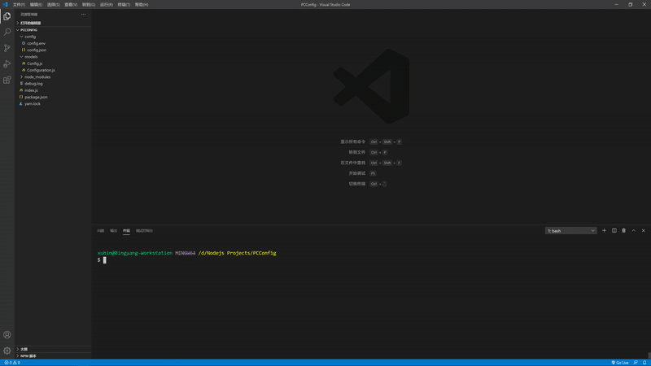

# 写个育琦同学的小工具

### 简单介绍
* RTX3000系列激动人心！
* 育琦同学换电脑预算30万。
* 调用kakaku.com上的数据。自动跟踪价格变化。

### 关于用到的技术
1. [selenium-webdriver](https://www.selenium.dev/selenium/docs/api/javascript/) - 自动化框架来实现自动填充，自动跳转，和抓取数据。
2. [Google Chrome](https://www.google.com/intl/zh-CN/chrome/) - 浏览器提供页面渲染和数据展示。
3. [MongoDB Atlas](https://www.mongodb.com/cloud/atlas) - 云化的MongoDB数据库服务，有免费版。
4. [Node.js](https://nodejs.org/zh-cn/download/) - 一个热门的JavaScript运行时。

### 效果预览



### 使用说明
###### 1. 下载并安装 [Node.js](https://nodejs.org/zh-cn/download/)
###### 2. 获取 MongoDB 的连接 URI. 推荐用[MongoDB Altas](https://www.mongodb.com/cloud/atlas).
###### 2. 查询浏览器版本（以Chrome为例子）

###### 3. 根据浏览器版本，在 [webdriverJS官网](https://www.selenium.dev/selenium/docs/api/javascript/) 匹配下载相应驱动。
###### 4. 把 webdriver 的存放路径配置到 PATH 里。
###### 5. ```git clone https://github.com/xubingyang/myAssets.git```
###### 6. ```cd PCConfig```进入项目文件夹
###### 7. ```yarn```或者```npm install```(Yarn需要单独安装)
###### 8. 修改 config/config-temp.env 后，改名为 config.env （删除-temp）
###### 9. 修改 config/config-temp.json 后，改名为 config.json （删除-temp）
###### 10. ```yarn run start```或者```npm run start```

### 不确定的更新计划
* 优化代码。
* 支持同意硬件的多组选择功能。
* 前台展示。

### 版本更新说明
* 1.0.0 - 2020/09/2
   * 惊雷一声，应用完成。
